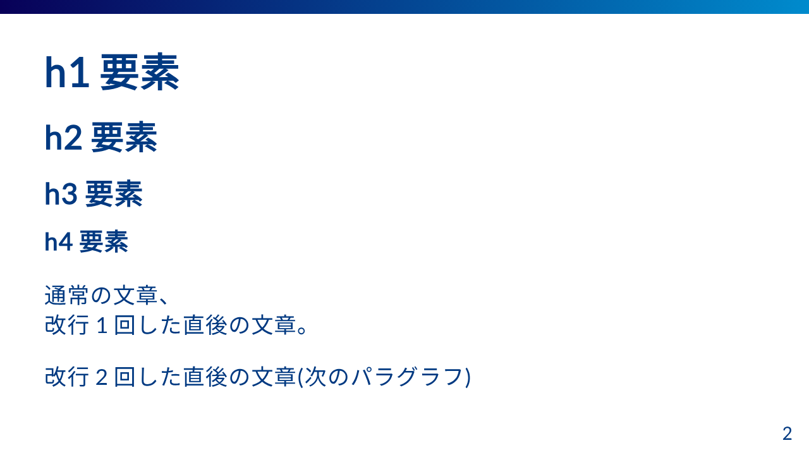
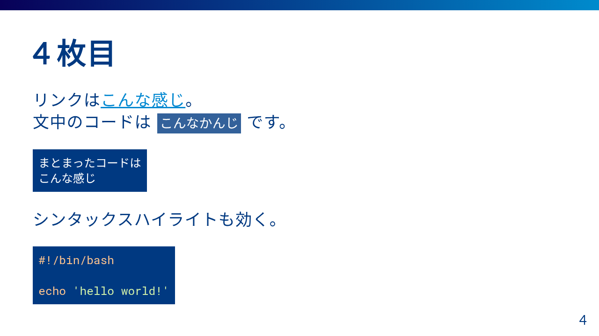

# marp-blue-theme

青を基調としたmarp テーマ

# 使用例

 | 
:-------------------------:|:-------------------------:
 | 

# 使い方

## VS Codeの場合

1. [【VS Code \+ Marp】Markdownから爆速・自由自在なデザインで、プレゼンスライドを作る \- Qiita](https://qiita.com/tomo_makes/items/aafae4021986553ae1d8#%E3%82%AB%E3%82%B9%E3%82%BF%E3%83%A0%E3%83%86%E3%83%BC%E3%83%9E%E3%82%92%E4%BD%BF%E3%81%86)を参考にVS Codeの設定へ `https://raw.githubusercontent.com/Milix-M/marp-blue-theme/refs/heads/main/marp-themes/blue.css` を設定
2. [example.md](example/example.md) をコピーまたは参考にしてmarkdownファイルを作成する

## Marp CLIの場合

ローカルにテーマファイルをダウンロードして使用する。

```bash
curl -o blue.css https://raw.githubusercontent.com/Milix-M/marp-blue-theme/refs/heads/main/marp-themes/blue.css
marp example.md -o example.pptx --theme-set blue.css --allow-local-files
```

# 開発方法

## 依存物

1. npmとmakeをインストールする
1. `make init` で必要なパッケージをインストールする

## 開発手順

1. vscode で marp 拡張をインストール
1. `make csswatch` で scss が変更されたらすぐ反映されるようにする
1. `make marpwatch` で css や markdown が変更されたらすぐ反映されるようにする
3. `example/example.md` を開き、vscode でプレビューしながらマークダウンファイルと SCSS を編集する

## 設計ノート

コントリビュートしてもらうときは以下を一読した上で機能追加・修正方向を考えてもらうと助かります 💦

### フォントは基本的に[Google Font](https://fonts.google.com/)を使用する

フォント指定でたくさん指定してfallbackを設定するのはウェブサイトでは有効だけど、marpでは人によってフォントが違う原因になり厄介になりやすい。
またテストでの画像比較も問題が起きやすくなる。
ウェブフォントの重いというデメリットもmarpの場合は気にならないので、ポータビリティに全振りして基本ウェブフォントとする。

### このリポジトリはCICDやgitのpre hookによるコントリビュートホスピタリティに全振りしている

だからかなりコントリビュートしやすくなっているはず。なるべくそこは維持していきたい。

# ライセンスについて

本リポジトリに含まれるリソースは[ライセンス](./LICENSE)に属します。

